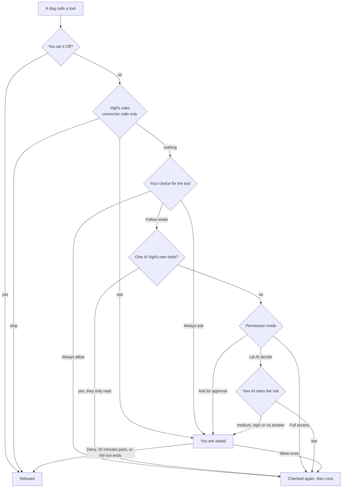
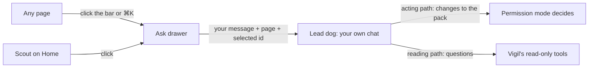
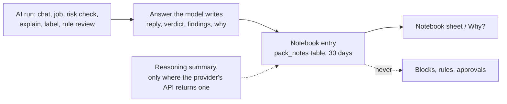
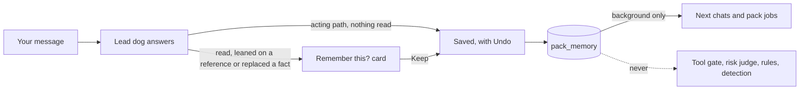

# The pack

The Pack page shows Vigil's own AI agents as dogs. The third-party coding agents Vigil watches (Claude Code, Codex and the rest) stay on the Agents page under their own names.

- **The Lead dog** is the one you talk to. It answers from Vigil's read-only tools and any connector tools you gave it (on its reading path, below), and it looks after the pack: it adds a dog for a job you describe, changes a dog, sends one off on its job, or retires one.
- **Pack dogs** each have a standing job, a schedule (when asked, hourly, daily or nightly) and the tools you let them use. A run ends in a short report with findings.
- **Built-in helpers** are Vigil's existing AI jobs: Sunny explains each new alert (the AI opinion on the alert), Biscuit tags events no rule matched as unusual or suspicious (shown in Activity; it never blocks anything), and Duke reviews rules once a day (its ideas wait under Suggested changes on Rules until you accept them). You can rename them and pick their breed; their jobs are fixed. They move on the page while those jobs run.

No dog can block or allow anything on the Mac, release a block, answer a watched agent's pre-flight check, or approve or edit a rule. No tool that does any of that exists.

## Permission modes

The mode at the top of the page works like a coding agent's permission modes.

| Mode             | Changes to the pack (Lead dog)                                                         | Tool calls that can change things                                    |
| ---------------- | -------------------------------------------------------------------------------------- | -------------------------------------------------------------------- |
| Ask for approval | Every change waits for your OK                                                         | You are asked                                                        |
| Let AI decide    | Adding, changing or running a dog goes ahead if it only has read-only tools; else asks | Your AI rates the call; only low risk goes ahead, the rest are asked |
| Full access      | Go ahead                                                                               | Go ahead                                                             |

Retiring a dog always asks in Let AI decide.

Scheduled runs never stop to ask. Nobody is watching them, so a call that
would need your OK is skipped, and the dog says in its report what it would
have done. Only runs you start (Run now, or a chat) ask, and a question still
open when its run ends goes away with it.

### Who sees outside text

Text Vigil didn't write and you didn't type can carry instructions: a file name, an alert, a web page a connector fetched, a dog's report. So the Lead dog answers each message along two paths, and the one that can change the pack never reads such text (`main/pack/service.ts`, `say`).

- **The acting path** is the model call that may propose changes: add, change, run or retire a dog, remember or forget a fact. Its prompt holds only your own messages and clean state: dog names and jobs you typed or that are built in, report summaries from runs that read nothing outside, memory facts from your words, earlier answers that read nothing outside, and Vigil's own tools by key with Vigil's titles. Everything else is there only as a reference: `answer-3` for an earlier answer that read outside text, `report:<dog id>`, `job:<dog id>`, `memory:<id>`, a dog with an outside name by its id, and every connector tool as `tool-3` with a label Vigil writes ("connector tool 3 from github"), never the server's key, title or description. The acting path calls no tools. Its changes are your request, so they go through the gate as clean and apply as your mode allows: "Rename Pip to Spot", "Create a dog to find duplicate files" and "Change Pip's job to check Downloads" stay instant.
- **Names and keys you type** are mapped to ids by Vigil, not the model, by exact match: a dog's whole name in any case (so "Run Pip" finds Pip even when its name came from outside text), and a connector tool's key exactly, same case, never part of a longer key ("github.create_issue_preview" doesn't vouch for "github.create_issue"). A connector key the model gives that you didn't type is dropped.
- **The reading path** answers questions that need outside text: what a dog found, what a job says, what an alert is, what's on this Mac, a connector's output. The acting path asks for it with a question and the references it needs, or Vigil sends a message there itself when it plainly asks about a report or the memory. This call may see anything and use the Lead dog's tools, but its answer has no field for changes: it is shown to you, kept as outside text, and appears to the acting path only as `answer-<n>`.
- **The bridge.** When your message leans on text the acting path never saw ("do what Pip suggested", "carry out the recommendation", "yes" right after a reading answer, or a reference like `answer-3`), or the acting path cites a reference, every change in that turn waits for your OK, in every mode, Full access included. Memory changes wait too when the turn also went down the reading path, when a fact replaces one your message doesn't name word for word, or when the fact to forget came from outside text.

Pack dogs' own runs keep their provenance: a run that used a tool, or whose prompt held a tainted job, report or memory fact, writes a tainted report. Their connector tools are offered as `tool_1`, `tool_2` and so on, never by the server's name, and every call goes through the tool gate below. Changes saved by older versions keep their recorded taint: approving one keeps an outside name or job marked, until you edit the dog yourself.

## How a tool call is decided

`apps/desktop/src/main/pack/gate.ts`:

In a scheduled run, "You are asked" is "Skipped" instead.

Right before any call goes out, Vigil checks again that the tool is still on, the dog still has it and isn't napping, the connector is still on, and no rule stops it. After the AI rates a call, the whole check runs again, so a mode or tool choice you changed while it was rating wins. Waiting for you or for the AI can take minutes, and a change you made meanwhile wins.

Vigil's rules come first in every mode, Full access included. Connector calls are checked as if a watched agent's hook had asked about an MCP tool (`mcp__<connector>__<tool>`, with the arguments as the command), so the agent pre-flight rules and your own tool rules from Agents › Tool policy apply. Nothing is recorded for these checks.

## On Home and every page

The Pack page sits under Advanced. Two parts of it reach the rest of the app:

- **Scout on Home.** The Lead dog sits next to Home's status line and acts it out: relaxed when nothing needs you, ears up (the waiting pose) when something needs your decision (the Needs you count) or a protection layer has stopped, and busy while a dog's AI job runs. The status words don't change; the dog only shows them. Clicking it opens Ask.
- **Today the pack.** Under the status line, one line per dog that did something since midnight ("The labeller sniffed through new events 5 times"), counted from the notebooks. The wording is fixed, never written by an AI, and names each dog by its role, never by its name, since the Lead dog can name dogs; runs that didn't finish are counted separately, and background runs that never reached an AI aren't noted. When a pack dog's latest run today found something of medium or high severity, one more line says so ("A pack dog found 2 things worth a look"); info and low findings add nothing. That line is not an alert: no notification, nothing in Needs you. Each line opens that dog's notebook.
- **Scout on a pile.** When Needs you holds a pile of three or more alerts (the alerts' own grouping: same rule, same agent run or program), the biggest one shows as Scout's card instead of a row: who set it off, how many times, and one button to look at them all, where "That was me, all N" and "Looks fine, all N" decide them together. Scout adds no grouping of its own and the wording is fixed.
- **Ask.** A bar at the bottom of every page (except Pack and setup) opens a chat drawer with the Lead dog. It is closed until you open it (click the bar or press ⌘K; Esc closes it). It is the same conversation as the Pack page, sent as your own chat, so the same rules apply: a Claude plan only if you turned it on, and no dog blocks, allows or changes a rule. The drawer tells the Lead dog which page you're on and what you have selected there (an alert, a rule, an agent or one of its sessions, or Activity's filter to one agent or session), so "what's this?" works; the Lead dog's reading path reads the details with its read-only tools. Its tools are the ones listed in [agents.md](agents.md#the-tools): status, alerts, events (by agent, rule matches or Biscuit's labels), rules, what Vigil did, and agents. When you ask how to stop an alert repeating, it points you to "Stop alerting on this" on the alert or to the rule on Rules; it can't change either itself.

A half-written message stays in the box when you change pages or close the drawer. If a message doesn't reach the Lead dog, the words go back in the box with the reason. With no AI set up, neither Enter nor the starter questions send anything.

## Which AI runs what

| Work                                         | Purpose | May use a Claude plan                                  |
| -------------------------------------------- | ------- | ------------------------------------------------------ |
| A message you send the Lead dog (both paths) | chat    | Yes, if you turned on the plan in Settings › AI        |
| Risk check during your chat                  | chat    | Same as the chat                                       |
| A pack dog's job (scheduled or Run now)      | analyze | Never                                                  |
| Risk check during a pack dog's job           | analyze | Never: a Claude API key, Codex, the cloud API or local |

If only a Claude plan is set up, pack jobs can't run and Let AI decide asks about every risky call in them.

## Plain wording

The pack talks with a little dog in it ("Biscuit sniffed through new events",
"Back with a report"). **Plain wording** on the Pack page turns that off: the
diary, the helpers' status lines and the Lead dog's replies use plain
sentences. The dogs, their names and everything they do stay the same.

## Notebooks

Every dog keeps a notebook of its AI runs: what it was asked, which tools or
evidence it looked at, what it answered, and the reasons it wrote down. Open
it with **Notebook** on a dog's card, or **Why?** next to an alert's AI
opinion, which shows every note about that alert (the explainer's, and any
chat about it from the Ask drawer).

- Reasons are only what the model put in its answer: the Lead dog's and pack
  jobs' `why` points, a job's findings, the judge's one-line reason, the
  explainer's details, the labeller's per-event reason and the rule reviewer's
  rationale. Nothing a provider keeps private is asked for or extracted. The
  `thinking` field is filled only from a reasoning summary an official API
  returns, and today none of the runners return one, so it stays empty.
- Notes stay on the Mac in Vigil's database, in a table the notebook creates
  itself (no migration), for 30 days and at most 2,000 notes per dog. Each
  write trims that dog's notes and every start trims them all, so a dog that
  went quiet doesn't keep old ones. Retiring a dog deletes its notebook; the
  Lead dog's and the helpers' are never touched by that. A run or risk check
  that finishes after its dog was retired writes nothing, and every start
  drops any notes left from a dog that no longer exists, whatever their age.
- Nothing reads notes back to decide anything. They are for the person.

**Details**, closed until you open it, is for digging deeper. It lists each
tool call the run made: the tool, its arguments, whether it ran, didn't run
(and why: the gate, you, a scheduled run that can't ask, or the run ending)
or failed, and the first 800 characters of what it returned. Every field of
a note (what was asked, the answer, reasons, tool titles, error text, and the
arguments and results as data, before they are written out as text) goes
through Vigil's redactor before it is stored, and is cut to size only after
that. The whole note is then redacted again as the text that is stored,
object keys included (the shared redactor keeps keys, so the pack redacts
each one too, and reads a result that is JSON text as data). Notes are
redacted the same way each time they are read for the page, so older notes
get the same treatment. It also shows the model and, from the Usage page's ledger, the tokens
and estimated cost of the attempt that answered. Notes from before this was
added simply have no Details.

**Copy as Markdown** and **Copy JSON** at the bottom of the sheet copy up to
the 200 newest notes in it to the clipboard, for an issue or a file. The app
renders the export and redacts the finished Markdown or JSON as a whole, so
the heading, the sheet's title and dog names are covered too; where the whole
Markdown would be withheld, each line is redacted on its own instead.

## Memory

The pack remembers lasting facts from your own words, so you don't have to
repeat them: the apps and coding agents you use, your network, how you want
answers worded. It follows the shape of Cognition's
[agent memory repo](https://cognition.com/agent-memory-repo): one short list,
one line per fact, each with where it came from and when, grouped by topic
(About you, This Mac, Apps and tools, Network, Coding agents, How the pack
works). **Memory** on the Lead dog's panel lists it; you can add a line,
forget one, or copy the whole thing as a `MEMORY.md`.

What it changes for a security app, compared with a coding agent's memory:

- **Only your words go in.** The Lead dog's acting path may note a fact
  (`remember`) or cross one out (`forget`, `replaces`). It never reads
  outside text, so Vigil applies that straight away, except that it waits on
  a "Remember this?" card when the same message also went down the reading
  path, leans on a report or an earlier answer, replaces a fact your message
  doesn't name word for word, or forgets a fact that came from outside text. Pack jobs and the built-in helpers read memory
  and never write it, and no AI tidies it in the background (the post's
  "dreaming" step): duplicates are caught when a fact is saved, and a
  replacement crosses out the line it updates.
- **Background, never permission.** Each run is told memory cannot make a
  file, app, address or tool call safe or allowed, and never outranks a rule,
  an alert or what you say now. Structurally, only `PackService` reads it:
  the tool gate, the "Let AI decide" risk judge, Vigil's rules and detection
  never see it.
- **No secrets.** A line the redactor would hide (keys, tokens, passwords,
  email addresses) is refused, not stored.
- **Small.** Up to 100 lines, each up to 200 characters. The newest that fit
  ride along with each chat and pack job; when some don't fit, the dog gets a
  `recall_memory` tool to search the rest. On the acting path it hands back
  a fact from outside text only as `memory:<id>`.

Memory lives in its own `pack_memory` table on this Mac, created by
`main/pack/memory.ts` like the notebooks' table, outside the numbered
migrations.

## Connectors

Connectors are your own MCP servers, added on the Pack page under Tools and connectors: a command on this Mac (stdio) or a URL (streamable HTTP). Vigil is the MCP client; the model sees only the tools and their results, never a token. Environment values and bearer tokens are encrypted with the Keychain-backed key the API keys use, in `pack-secrets.json` (mode 0600). Vigil never reads another app's MCP settings.

Each connector tool gets the same four choices as Vigil's own: Follow mode, Always ask, Always allow, Off. A connector tool never counts as read-only, even when its server marks it so: MCP treats those hints as untrusted, and Vigil can't check them. The page shows the server's claim ("Server says it only reads"), but the tool still follows your permission mode, and in Let AI decide a dog given one waits for your OK. Set a tool you trust to Always allow and it is treated as read-only from then on.

Connections close after five idle minutes.

What a connector returns is redacted before anything else sees it (the
notebook, the risk judge, a cloud model): keys, tokens, passwords, email
addresses and home folder names are replaced, as in the data Vigil sends any
model. The AI runner redacts tool results again on their way out.

A connector runs your program, not Vigil's. Vigil tells Agent watch the server's process id as soon as it starts, so the server and everything it runs are tagged `vigil-connector` in a session of their own (shown as "A pack connector" in Activity), and every Agent watch rule applies to them. They never share the `vigil-self` tag of Vigil's own AI helpers. A command inside Vigil's own app is refused, because Vigil never blocks its own binaries.

## Animations

The dogs are original SVG drawings built from shapes in `components/Dog.tsx`: husky (Scout, the Lead dog, by default), shepherd, doberman, golden retriever, beagle, corgi, dachshund and chihuahua. Moods come from real work:

| Mood     | When                            | Animation                                 |
| -------- | ------------------------------- | ----------------------------------------- |
| idle     | Nothing to do                   | A blink and a short wag every few seconds |
| thinking | Waiting on the model            | Head tilt, dots in a bubble               |
| sniffing | Using one of Vigil's tools      | Trot, nose down, sniff puffs              |
| fetching | Using a connector tool          | Trot with a bone, speed lines             |
| waiting  | A tool call or change needs you | Head tilt, a bobbing question mark        |
| done     | Just finished                   | A hop and a star                          |
| error    | A run failed                    | Head and tail down, red bubble            |
| sleeping | Switched off (napping)          | Lying down, eyes shut, z z Z              |

Only transforms and opacity animate, idle dogs move for a moment every few seconds, and nothing moves with Reduce motion on. Mood changes reach the window at most every 150 ms on their own `pack` channel, so other pages don't reload.
