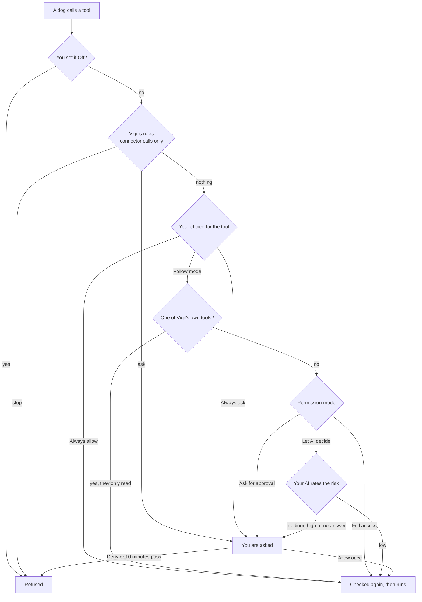
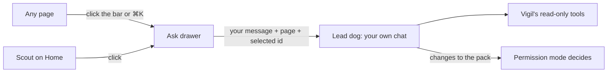
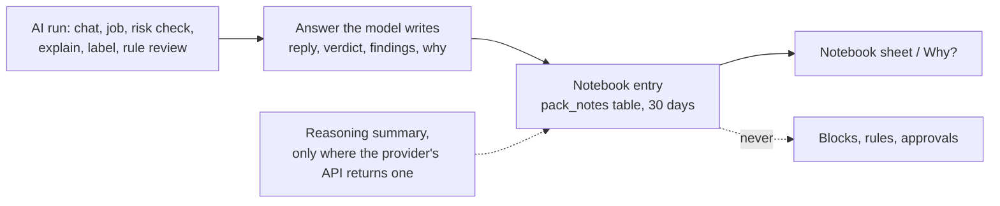
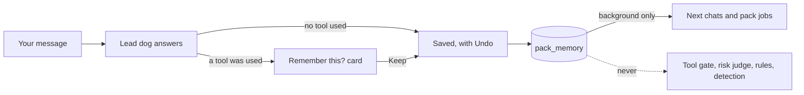

# The pack

The Pack page shows Vigil's own AI agents as dogs. The third-party coding agents Vigil watches (Claude Code, Codex and the rest) stay on the Agents page under their own names.

- **The Lead dog** is the one you talk to. It answers from Vigil's read-only tools and any connector tools you gave it, and it looks after the pack: it adds a dog for a job you describe, changes a dog, sends one off on its job, or retires one.
- **Pack dogs** each have a standing job, a schedule (when asked, hourly, daily or nightly) and the tools you let them use. A run ends in a short report with findings.
- **Built-in helpers** are Vigil's existing AI jobs: Sunny explains alerts, Biscuit labels events, Duke reviews rules. You can rename them and pick their breed; their jobs are fixed. They move on the page while those jobs run.

No dog can block or allow anything on the Mac, release a block, answer a watched agent's pre-flight check, or approve or edit a rule. No tool that does any of that exists.

## Permission modes

The mode at the top of the page works like a coding agent's permission modes.

| Mode             | Changes to the pack (Lead dog)                                                          | Tool calls that can change things                                    |
| ---------------- | --------------------------------------------------------------------------------------- | -------------------------------------------------------------------- |
| Ask for approval | Every change waits for your OK                                                          | You are asked                                                        |
| Let AI decide    | Adding, changing or running a dog goes ahead if it only gets read-only tools; else asks | Your AI rates the call; only low risk goes ahead, the rest are asked |
| Full access      | Go ahead                                                                                | Go ahead                                                             |

Retiring a dog always asks in Let AI decide.

A change from an answer that read someone else's text waits for your OK in every mode. Provenance travels with the text: a tool's output, a connector's tool titles and descriptions, a dog's report, a job or memory fact that came from such an answer (even one you then approved), and anything saved before this was recorded all count. The Lead dog's prompt leaves a tainted report, job or memory fact out unless your message asks about it (names the dog with a word like "report", "found" or "job", or shares a word with the fact), so a typed "Rename Pip to Spot" stays clean. An earlier answer's taint carries over only to a short "yes, do it". A job becomes clean again when you edit the dog yourself.

## How a tool call is decided

`apps/desktop/src/main/pack/gate.ts`:

Right before any call goes out, Vigil checks again that the tool is still on, the dog still has it and isn't napping, the connector is still on, and no rule stops it. Waiting for you or for the AI can take minutes, and a change you made meanwhile wins.

Vigil's rules come first in every mode, Full access included. Connector calls are checked as if a watched agent's hook had asked about an MCP tool (`mcp__<connector>__<tool>`, with the arguments as the command), so the agent pre-flight rules and your own tool rules from Agents › Tool policy apply. Nothing is recorded for these checks.

## On Home and every page

The Pack page sits under Advanced. Two parts of it reach the rest of the app:

- **Scout on Home.** The Lead dog sits next to Home's status line and acts it out: relaxed when nothing needs you, ears up (the waiting pose) when something needs your decision (the Needs you count) or a protection layer has stopped, and busy while a dog's AI job runs. The status words don't change; the dog only shows them. Clicking it opens Ask.
- **Today the pack.** Under the status line, one line per dog that did something since midnight ("Biscuit sniffed through new events 5 times"), counted from the notebooks. The wording is fixed, never written by an AI; runs that didn't finish are counted separately, and background runs that never reached an AI aren't noted. Each line opens that dog's notebook.
- **Scout on a pile.** When Needs you holds a pile of three or more alerts (the alerts' own grouping: same rule, same agent run or program), the biggest one shows as Scout's card instead of a row: who set it off, how many times, and one button to look at them all, where "That was me, all N" and "Looks fine, all N" decide them together. Scout adds no grouping of its own and the wording is fixed.
- **Ask.** A bar at the bottom of every page (except Pack and setup) opens a chat drawer with the Lead dog. It is closed until you open it (click the bar or press ⌘K; Esc closes it). It is the same conversation as the Pack page, sent as your own chat, so the same rules apply: a Claude plan only if you turned it on, and no dog blocks, allows or changes a rule. The drawer tells the Lead dog which page you're on and the id of what you have selected there (an alert, rule, agent or event), so "what's this?" works; the Lead dog reads the details with its read-only tools.

A half-written message stays in the box when you change pages or close the drawer. If a message doesn't reach the Lead dog, the words go back in the box with the reason. With no AI set up, neither Enter nor the starter questions send anything.

## Which AI runs what

| Work                                    | Purpose | May use a Claude plan                                  |
| --------------------------------------- | ------- | ------------------------------------------------------ |
| A message you send the Lead dog         | chat    | Yes, if you turned on the plan in Settings › AI        |
| Risk check during your chat             | chat    | Same as the chat                                       |
| A pack dog's job (scheduled or Run now) | analyze | Never                                                  |
| Risk check during a pack dog's job      | analyze | Never: a Claude API key, Codex, the cloud API or local |

If only a Claude plan is set up, pack jobs can't run and Let AI decide asks about every risky call in them.

## Plain wording

The pack talks with a little dog in it ("Biscuit sniffed through new events",
"Back with a report"). **Plain wording** on the Pack page turns that off: the
diary, the helpers' status lines and the Lead dog's replies use plain
sentences. The dogs, their names and everything they do stay the same.

## Notebooks

Every dog keeps a notebook of its AI runs: what it was asked, which tools or
evidence it looked at, what it answered, and the reasons it wrote down. Open
it with **Notebook** on a dog's card, or **Why?** next to an alert's AI
opinion, which shows every note about that alert (the explainer's, and any
chat about it from the Ask drawer).

- Reasons are only what the model put in its answer: the Lead dog's and pack
  jobs' `why` points, a job's findings, the judge's one-line reason, the
  explainer's details, the labeller's per-event reason and the rule reviewer's
  rationale. Nothing a provider keeps private is asked for or extracted. The
  `thinking` field is filled only from a reasoning summary an official API
  returns, and today none of the runners return one, so it stays empty.
- Notes stay on the Mac in Vigil's database, in a table the notebook creates
  itself (no migration), for 30 days and at most 2,000 notes per dog.
- Nothing reads notes back to decide anything. They are for the person.

## Memory

The pack remembers lasting facts from your own words, so you don't have to
repeat them: the apps and coding agents you use, your network, how you want
answers worded. It follows the shape of Cognition's
[agent memory repo](https://cognition.com/agent-memory-repo): one short list,
one line per fact, each with where it came from and when, grouped by topic
(About you, This Mac, Apps and tools, Network, Coding agents, How the pack
works). **Memory** on the Lead dog's panel lists it; you can add a line,
forget one, or copy the whole thing as a `MEMORY.md`.

What it changes for a security app, compared with a coding agent's memory:

- **Only your words go in.** The Lead dog may note a fact (`remember`) or
  cross one out (`forget`, `replaces`). Vigil applies that straight away only
  when the answer used no tool, so it rested on your message alone. If the
  answer read an alert, an event or a connector, text in there could have
  been written by whoever made the file or the web page, so the change waits
  on a "Remember this?" card. Pack jobs and the built-in helpers read memory
  and never write it, and no AI tidies it in the background (the post's
  "dreaming" step): duplicates are caught when a fact is saved, and a
  replacement crosses out the line it updates.
- **Background, never permission.** Each run is told memory cannot make a
  file, app, address or tool call safe or allowed, and never outranks a rule,
  an alert or what you say now. Structurally, only `PackService` reads it:
  the tool gate, the "Let AI decide" risk judge, Vigil's rules and detection
  never see it.
- **No secrets.** A line the redactor would hide (keys, tokens, passwords,
  email addresses) is refused, not stored.
- **Small.** Up to 100 lines, each up to 200 characters. The newest that fit
  ride along with each chat and pack job; when some don't fit, the dog gets a
  `recall_memory` tool to search the rest. Using it doesn't count as using a
  tool for the rule above, since it only reads your own words back.

Memory lives in its own `pack_memory` table on this Mac, created by
`main/pack/memory.ts` like the notebooks' table, outside the numbered
migrations.

## Connectors

Connectors are your own MCP servers, added on the Pack page under Tools and connectors: a command on this Mac (stdio) or a URL (streamable HTTP). Vigil is the MCP client; the model sees only the tools and their results, never a token. Environment values and bearer tokens are encrypted with the Keychain-backed key the API keys use, in `pack-secrets.json` (mode 0600). Vigil never reads another app's MCP settings.

Each connector tool gets the same four choices as Vigil's own: Follow mode, Always ask, Always allow, Off. A connector tool never counts as read-only, even when its server marks it so: MCP treats those hints as untrusted, and Vigil can't check them. The page shows the server's claim ("Server says it only reads"), but the tool still follows your permission mode, and in Let AI decide a dog given one waits for your OK. Set a tool you trust to Always allow and it is treated as read-only from then on.

Connections close after five idle minutes.

A connector runs your program, not Vigil's. Vigil tells Agent watch the server's process id as soon as it starts, so the server and everything it runs are tagged `vigil-connector` in a session of their own (shown as "A pack connector" in Activity), and every Agent watch rule applies to them. They never share the `vigil-self` tag of Vigil's own AI helpers. A command inside Vigil's own app is refused, because Vigil never blocks its own binaries.

## Animations

The dogs are original SVG drawings built from shapes in `components/Dog.tsx`: husky (Scout, the Lead dog, by default), shepherd, doberman, golden retriever, beagle, corgi, dachshund and chihuahua. Moods come from real work:

| Mood     | When                            | Animation                                 |
| -------- | ------------------------------- | ----------------------------------------- |
| idle     | Nothing to do                   | A blink and a short wag every few seconds |
| thinking | Waiting on the model            | Head tilt, dots in a bubble               |
| sniffing | Using one of Vigil's tools      | Trot, nose down, sniff puffs              |
| fetching | Using a connector tool          | Trot with a bone, speed lines             |
| waiting  | A tool call or change needs you | Head tilt, a bobbing question mark        |
| done     | Just finished                   | A hop and a star                          |
| error    | A run failed                    | Head and tail down, red bubble            |
| sleeping | Switched off (napping)          | Lying down, eyes shut, z z Z              |

Only transforms and opacity animate, idle dogs move for a moment every few seconds, and nothing moves with Reduce motion on. Mood changes reach the window at most every 150 ms on their own `pack` channel, so other pages don't reload.
