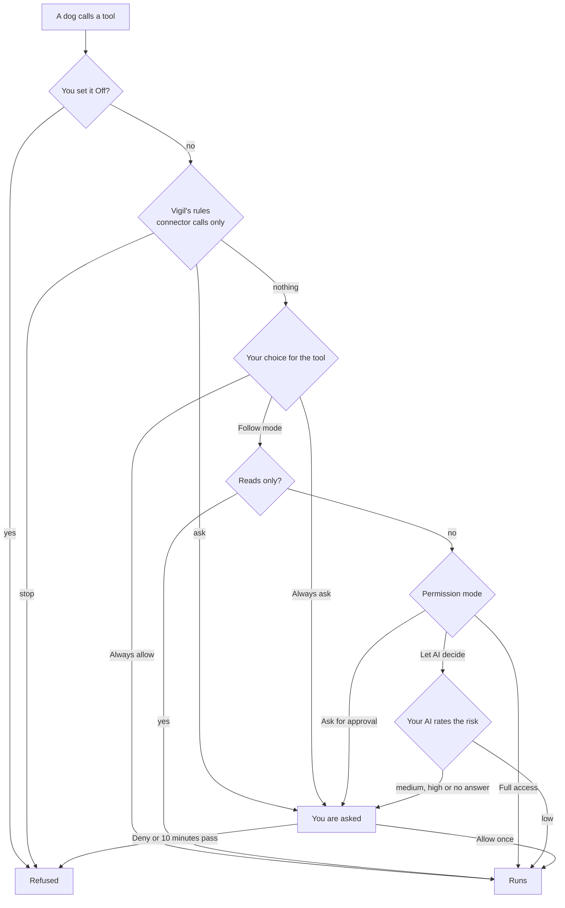

# The pack

The Pack page shows Vigil's own AI agents as dogs. The third-party coding agents Vigil watches (Claude Code, Codex and the rest) stay on the Agents page under their own names.

- **The Lead dog** is the one you talk to. It answers from Vigil's read-only tools and any connector tools you gave it, and it looks after the pack: it adds a dog for a job you describe, changes a dog, sends one off on its job, or retires one.
- **Pack dogs** each have a standing job, a schedule (when asked, hourly, daily or nightly) and the tools you let them use. A run ends in a short report with findings.
- **Built-in helpers** are Vigil's existing AI jobs: Sunny explains alerts, Biscuit labels events, Duke reviews rules. You can rename them and pick their breed; their jobs are fixed. They move on the page while those jobs run.

No dog can block or allow anything on the Mac, release a block, answer a watched agent's pre-flight check, or approve or edit a rule. No tool that does any of that exists.

## Permission modes

The mode at the top of the page works like a coding agent's permission modes.

| Mode             | Changes to the pack (Lead dog)                                                          | Tool calls that can change things                                    |
| ---------------- | --------------------------------------------------------------------------------------- | -------------------------------------------------------------------- |
| Ask for approval | Every change waits for your OK                                                          | You are asked                                                        |
| Let AI decide    | Adding, changing or running a dog goes ahead if it only gets read-only tools; else asks | Your AI rates the call; only low risk goes ahead, the rest are asked |
| Full access      | Go ahead                                                                                | Go ahead                                                             |

Retiring a dog always asks in Let AI decide.

## How a tool call is decided

`apps/desktop/src/main/pack/gate.ts`:

Vigil's rules come first in every mode, Full access included. Connector calls are checked as if a watched agent's hook had asked about an MCP tool (`mcp__<connector>__<tool>`, with the arguments as the command), so the agent pre-flight rules and your own tool rules from Agents › Tool policy apply. Nothing is recorded for these checks.

## Which AI runs what

| Work                                    | Purpose | May use a Claude plan                                  |
| --------------------------------------- | ------- | ------------------------------------------------------ |
| A message you send the Lead dog         | chat    | Yes, if you turned on the plan in Settings › AI        |
| Risk check during your chat             | chat    | Same as the chat                                       |
| A pack dog's job (scheduled or Run now) | analyze | Never                                                  |
| Risk check during a pack dog's job      | analyze | Never: a Claude API key, Codex, the cloud API or local |

If only a Claude plan is set up, pack jobs can't run and Let AI decide asks about every risky call in them.

## Connectors

Connectors are your own MCP servers, added on the Pack page under Tools and connectors: a command on this Mac (stdio) or a URL (streamable HTTP). Vigil is the MCP client; the model sees only the tools and their results, never a token. Environment values and bearer tokens are encrypted with the Keychain-backed key the API keys use, in `pack-secrets.json` (mode 0600). Vigil never reads another app's MCP settings.

Each connector tool gets the same four choices as Vigil's own: Follow mode, Always ask, Always allow, Off. A server's read-only hint counts as reads only; it is the server's word, so a tool you don't trust that far can be set to Always ask.

Connections close after five idle minutes.

## Animations

The dogs are original SVG drawings built from shapes in `components/Dog.tsx`: shepherd, doberman, husky, golden retriever, beagle, corgi, dachshund and chihuahua. Moods come from real work:

| Mood     | When                            | Animation                                 |
| -------- | ------------------------------- | ----------------------------------------- |
| idle     | Nothing to do                   | A blink and a short wag every few seconds |
| thinking | Waiting on the model            | Head tilt, dots in a bubble               |
| sniffing | Using one of Vigil's tools      | Trot, nose down, sniff puffs              |
| fetching | Using a connector tool          | Trot with a bone, speed lines             |
| waiting  | A tool call or change needs you | Head tilt, a bobbing question mark        |
| done     | Just finished                   | A hop and a star                          |
| error    | A run failed                    | Head and tail down, red bubble            |
| sleeping | Switched off (napping)          | Lying down, eyes shut, z z Z              |

Only transforms and opacity animate, idle dogs move for a moment every few seconds, and nothing moves with Reduce motion on. Mood changes reach the window at most every 150 ms on their own `pack` channel, so other pages don't reload.
