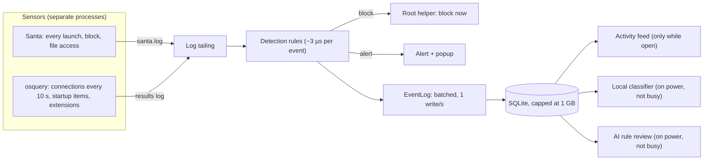

# Performance budget

Vigil runs all day on the laptop it protects, so it has to be something the
user never notices: no fan, no battery drain, no sluggish menu bar, no disk
filling up. This page is the budget every part of Vigil is held to, how it is
measured, and the rules that keep new features inside it.

## Which Macs

The target is the slowest Mac Vigil supports, not a new one. Electron 44 needs
macOS 12 or later, so the floor is a **2015–2017 dual-core Intel MacBook with
8 GB of memory** (for example a 2017 MacBook Air), and the **base 8 GB M1**
for Apple silicon. A budget met there is invisible on anything newer.

CI measures on GitHub's `macos-15-intel` and `macos-15` (M1) runners. They are
shared virtual machines, so their numbers are noisier than a real laptop's; the
check reports anything over budget and fails only on a clear overrun (the
`hard` column in [`apps/desktop/perf/budget.mjs`](../apps/desktop/perf/budget.mjs)).

## The budget

"CPU" is a percentage of one core, averaged over the period. "Memory" is what
Activity Monitor shows (physical footprint), summed over all of Vigil's
processes.

| Part                                            | Measure                       | Budget                                                        |
| ----------------------------------------------- | ----------------------------- | ------------------------------------------------------------- |
| App, nothing open                               | CPU                           | ≤ 0.5%                                                        |
|                                                 | Wakeups                       | ≤ 5 per second                                                |
|                                                 | Memory                        | ≤ 180 MB                                                      |
| App, main window open                           | Memory                        | ≤ 400 MB                                                      |
| App, after windows close                        | Memory                        | ≤ 200 MB (closed windows are released)                        |
| App, storing a burst of 50 events/s (compiling) | CPU                           | ≤ 3%                                                          |
|                                                 | Disk written per 1,000 events | ≤ 2 MB                                                        |
|                                                 | Disk used per 1,000 events    | ≤ 700 KB                                                      |
| Start-up                                        | Launch to menu-bar item       | ≤ 3 s                                                         |
| Menu-bar popover                                | First open / reopen           | ≤ 800 ms / ≤ 150 ms                                           |
| osquery (Vigil's schedule)                      | CPU                           | ≤ 1.5% (its watchdog stops it at 10%)                         |
|                                                 | Memory                        | ≤ 80 MB (watchdog: 200 MB)                                    |
| Reading the sensor logs                         | CPU / wakeups                 | ≤ 0.1% / ≤ 2 per second                                       |
| Local classifier (optional)                     | CPU, averaged over an hour    | ≤ 2%, only on mains power and when the Mac is not busy        |
|                                                 | Memory while loaded           | ≤ 0.6 GB on 8 GB Macs, ≤ 1.2 GB otherwise; unloaded when idle |
| Database                                        | Size on disk                  | ≤ 1 GB, oldest unreferenced events dropped first              |

Blocking is outside the budget on purpose: a block never waits for anything on
this page, and nothing here ever slows or pauses it.

## Where the cost goes



The inline path (tailing, detection, block) has to be cheap on every event.
Everything after the EventLog can wait, batch, or skip a turn.

## Rules for every part

1. **Nothing on the block path waits.** Detection and blocking never wait for
   the disk, the network, the AI or the power state.
2. **Write in batches.** Sensor events go through `core.events` (`EventLog`),
   which writes once a second in one transaction. A commit per event wrote
   about 15 times more to the disk than batching does (see measurements).
   Don't keep a second copy of the event history; the detection package's
   history should read from and write to the same table.
3. **Store what rules read.** The sensor's `raw` record roughly doubles an
   event's size and no rule reads it, so the event log drops it. Events an
   alert refers to keep it.
4. **No fast polling.** Nothing wakes the Mac more than once a second while
   idle. Prefer being told (kqueue via `fs.watch`, powerMonitor events) over
   asking, and don't leave timers running when there is nothing to do.
5. **Optional work checks `power.isBusy()`.** On battery, when the Mac is hot,
   asleep or already loaded (load above 0.8 per core), the classifier, AI rule
   reviews and anything else that can wait holds off. Routine scheduler jobs
   run 4× less often on battery and pause when the Mac is hot or asleep.
6. **Renderers only while visible.** Each window's page is its own process
   (30–80 MB on macOS). The main window's goes when it closes and a hidden
   popup's after a minute. The popover is the one kept loaded, because
   opening it cold took 1–2 seconds. The activity feed renders only visible
   rows and asks the main process for new events at most once a second, only
   while open.
7. **A CPU budget for AI, not a request count.** Local model work is limited
   by CPU seconds per hour (72 s/hour is 2% of one core), measured per batch,
   so a slow Mac automatically does less rather than doing the same work
   slower.
8. **Measure it.** A change to a hot path adds or updates a measurement in
   `apps/desktop/perf/` rather than asserting it's fast.

## Measure it yourself

```bash
pnpm install
pnpm --filter @vigil/desktop build
cd apps/desktop
node perf/measure.mjs               # the app; add xvfb-run -a on Linux
sudo node perf/sensors.mjs          # osquery and log tailing (macOS, needs osquery)
```

Both print a table and write JSON to `apps/desktop/perf-results/`. In CI they
run in the `perf` job of [`.github/workflows/macos.yml`](../.github/workflows/macos.yml),
with the tables in the job summary.

## Measurements

Measured on 2026-09-28 in the `perf` job, on GitHub's `macos-15-intel`
(i7-8700B, 4 vCPU, 14 GB) and `macos-15` (M1, 3 vCPU, 7 GB, no GPU) runners,
before the popover was kept loaded.

### App

| Measure                              | Intel         | M1            | Budget         |
| ------------------------------------ | ------------- | ------------- | -------------- |
| Start to menu-bar item               | 1.2 s         | 2.8 s         | 3 s            |
| Idle CPU                             | 0.26%         | 0.18%         | 0.5%           |
| Idle wakeups                         | 1.1/s         | 1.4/s         | 5/s            |
| Idle memory, nothing open            | 48 MB         | 41 MB         | 180 MB         |
| Memory, main window open             | 150 MB        | 122 MB        | 400 MB         |
| Memory after windows close           | 65 MB         | 59 MB         | 200 MB         |
| Popover, first open / reopen         | 1,864 / 11 ms | 1,064 / 55 ms | 800 / 150 ms   |
| CPU storing 50 events/s              | 1.15%         | 1.22%         | 3%             |
| Disk used / written per 1,000 events | 560 / 696 KB  | 557 / 672 KB  | 700 / 2,000 KB |

The first popover open was over budget, so the popover is now loaded two
seconds after start-up and kept (about 30–50 MB). Before events were batched,
every event was its own commit: on Linux that wrote about 22 MB per 1,000
events for 0.5 MB stored and used twice the CPU.

### Sensors

| Measure                            | Intel                | M1            | Budget    |
| ---------------------------------- | -------------------- | ------------- | --------- |
| osquery CPU                        | 0.64%                | 0.81%         | 1.5%      |
| osquery memory                     | 10 MB                | 14 MB         | 80 MB     |
| osquery wakeups                    | 2.9/s                | 1.8/s         | 10/s      |
| Log tailing, 200 ms poll (current) | 0.3%, 14.9 wakeups/s | 0.28%, 12.6/s | 0.1%, 2/s |
| Log tailing, 1 s poll              | 0.05%, 3/s           | 0.08%, 2.5/s  |           |
| Log tailing, `fs.watch` + 2 s poll | 0.02%, 1.6/s         | 0.07%, 1.2/s  |           |

The network connection query is osquery's biggest cost (about 0.35 s of its
own work every 10 s). Reading the two logs every 200 ms wakes the Mac more
than the rest of Vigil put together; watching them with `fs.watch` and
polling every 2 s only to catch log rotation fits the budget.

### Local classifier

One batch of 20 events through Ollama with the classifier's current settings
(4k context, half the cores), on CPU:

| Model             | Intel, 2 threads                           | M1 VM, 1 thread       |
| ----------------- | ------------------------------------------ | --------------------- |
| qwen2.5:0.5b      | 56 s, 112 CPU-seconds, 1,254 output tokens | 133 s, 55 CPU-seconds |
| qwen2.5:1.5b      | 73 s, 145 CPU-seconds, 773 output tokens   | 174 s, 91 CPU-seconds |
| Loading the model | 5 s (0.5b), 15 s (1.5b)                    | 3 s, 34 s             |

Almost all the time is spent writing the answer (a label, score and reason
for every event). At 60 batches an hour that is nearly two full cores on the
Intel runner; the 72 CPU-seconds an hour budget allows less than one batch.
To fit, the classifier has to answer in far fewer tokens (only the events
that aren't benign, without reasons unless asked) and be limited by CPU
seconds rather than batches. The M1 runner is a VM without the GPU, so a real
Apple-silicon Mac runs Ollama several times faster.
