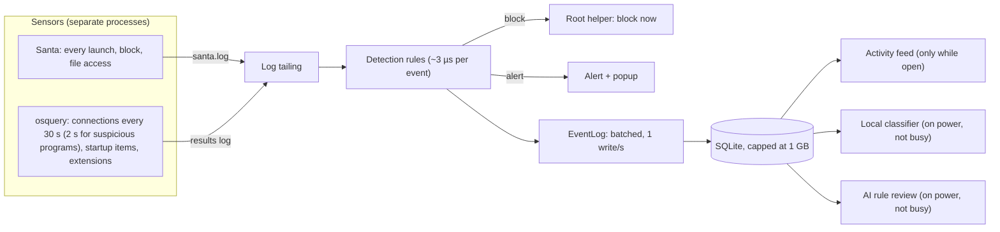

# Performance budget

Vigil runs all day on the laptop it protects, so it has to be something the
user never notices: no fan, no battery drain, no sluggish menu bar, no disk
filling up. This page is the budget every part of Vigil is held to, how it is
measured, and the rules that keep new features inside it.

## Which Macs

The target is the slowest Mac Vigil supports, not a new one. Electron 44 needs
macOS 12 or later, so the floor is a **2015–2017 dual-core Intel MacBook with
8 GB of memory** (for example a 2017 MacBook Air), and the **base 8 GB M1**
for Apple silicon. A budget met there is invisible on anything newer.

CI measures on GitHub's `macos-15-intel` and `macos-15` (M1) runners. They are
shared virtual machines, so their numbers are noisier than a real laptop's; the
check reports anything over budget and fails only on a clear overrun (the
`hard` column in [`apps/desktop/perf/budget.mjs`](../apps/desktop/perf/budget.mjs)).

## The budget

"CPU" is a percentage of one core, averaged over the period. "Memory" is what
Activity Monitor shows (physical footprint), summed over all of Vigil's
processes.

| Part                                        | Measure                       | Budget                                                        |
| ------------------------------------------- | ----------------------------- | ------------------------------------------------------------- |
| App, nothing open                           | CPU                           | ≤ 0.5%                                                        |
|                                             | Wakeups                       | ≤ 5 per second                                                |
|                                             | Memory                        | ≤ 180 MB                                                      |
| App, main window open                       | Memory                        | ≤ 400 MB                                                      |
| App, after windows close                    | Memory                        | ≤ 200 MB (closed windows are released)                        |
| App, handling 50 events/s (rules + storage) | CPU                           | ≤ 3%                                                          |
|                                             | Disk written per 1,000 events | ≤ 2 MB                                                        |
|                                             | Disk used per 1,000 events    | ≤ 700 KB                                                      |
| Start-up                                    | Launch to menu-bar item       | ≤ 3 s                                                         |
| Menu-bar popover                            | First open / reopen           | ≤ 800 ms / ≤ 150 ms                                           |
| osquery (Vigil's schedule)                  | CPU                           | ≤ 1.5% (its watchdog stops it at 10%)                         |
|                                             | Memory                        | ≤ 80 MB (watchdog: 200 MB)                                    |
| Reading the sensor logs                     | CPU / wakeups                 | ≤ 0.1% / ≤ 2 per second                                       |
| Local classifier (optional)                 | CPU, averaged over an hour    | ≤ 2%, only on mains power and when the Mac is not busy        |
|                                             | Memory while loaded           | ≤ 0.6 GB on 8 GB Macs, ≤ 1.2 GB otherwise; unloaded when idle |
| Database                                    | Size on disk                  | ≤ 1 GB, oldest unreferenced events dropped first              |
| Agent pre-flight hook (Claude Code)         | Per tool call it checks       | about 60–150 ms (Node.js start-up); Vigil answers in ≤ 5 ms   |
|                                             | Between tool calls            | nothing: no process, timer or wakeup                          |
| Vigil tools for agents (MCP, opt-in)        | Per call                      | one bounded read: 50 rows and 64 KB at most                   |
|                                             | All calls together            | ≤ 50 ms of main-thread time a second (bursts of 150 ms)       |
|                                             | Between calls                 | nothing in Vigil; the agent keeps its MCP server process      |
| Agent process tracker                       | Memory                        | about 2 MB (8,192 processes at most)                          |
|                                             | Time per event                | ≤ 5 µs on average                                             |
| Agent ancestry on stored events             | Disk per event                | ≤ 40 B on average                                             |

Blocking is outside the budget on purpose: a block never waits for anything on
this page, and nothing here ever slows or pauses it.

## Where the cost goes



The inline path (tailing, detection, block) has to be cheap on every event.
Everything after the EventLog can wait, batch, or skip a turn.

Following AI agents adds two costs. Each launch updates an in-memory process
tree (a map of at most 8,192 processes, about 2 MB) before the rules run, and
events an agent caused keep a few basenames of their ancestry in storage,
plus the agent's id in an indexed column (about 30 bytes) so the Activity
feed can show one agent's events without sorting them all. Other launches
keep only their parent's name, when the sensor gave no parent path, so a
rule on it replays as it ran.
Claude Code's pre-flight hook, when the user sets it up, starts Node.js once
per tool call it checks, about 60–150 ms that the agent waits and Vigil
doesn't: the app only answers a line on a local socket. See
[agents.md](agents.md).

## Rules for every part

1. **Nothing on the block path waits.** Detection and blocking never wait for
   the disk, the network, the AI or the power state.
2. **Write in batches.** Sensor events go through `core.events` (`EventLog`),
   which writes once a second in one transaction. A commit per event wrote
   about 15 times more to the disk than batching does (see measurements).
   Don't keep a second copy of the event history; the detection package's
   history should read from and write to the same table.
3. **Store what rules read.** The sensor's `raw` record roughly doubles an
   event's size and no rule reads it, so the event log drops it. Events an
   alert refers to keep it.
4. **No fast polling.** Nothing wakes the Mac more than once a second while
   idle. Prefer being told (kqueue via `fs.watch`, powerMonitor events) over
   asking, and don't leave timers running when there is nothing to do.
5. **Optional work checks `power.isBusy()`.** On battery, when the Mac is hot,
   asleep or already loaded (load above 0.8 per core), the classifier, AI rule
   reviews and anything else that can wait holds off. Routine scheduler jobs
   run 4× less often on battery and pause when the Mac is hot or asleep. If
   macOS never says the Mac woke up, Vigil checks every two minutes and
   counts it awake once someone uses it or it has run ten minutes without a
   check firing late (a late check means it slept: dark wakes don't count). A
   scheduled task still running after 30 minutes gives its place back so it
   can't hold up the rest, but its job doesn't start again until that run
   has ended.
6. **Renderers only while visible.** Each window's page is its own process
   (30–80 MB on macOS). The main window's goes when it closes and a hidden
   popup's after a minute. The popover is the one kept loaded, because
   opening it cold took 1–2 seconds. The activity feed renders only visible
   rows and asks the main process for new events at most once a second, only
   while open.
7. **A CPU budget for AI, not a request count.** Local model work is limited
   by CPU seconds per hour (72 s/hour is 2% of one core), measured per batch,
   so a slow Mac automatically does less rather than doing the same work
   slower.
8. **Measure it.** A change to a hot path adds or updates a measurement in
   `apps/desktop/perf/` rather than asserting it's fast.
9. **Hooks wait on rules only.** The agent socket answers a pre-flight hook
   from the rules, synchronously, before anything is stored; it never goes
   through the scheduler or the AI. Recording the request happens after the
   answer, and nothing about the socket runs while no hook is asking.

## Measure it yourself

```bash
pnpm install
pnpm --filter @vigil/desktop build
cd apps/desktop
node perf/measure.mjs               # the app; add xvfb-run -a on Linux
sudo node perf/sensors.mjs          # osquery and log tailing (macOS, needs osquery)
```

Both print a table and write JSON to `apps/desktop/perf-results/`. In CI they
run in the `perf` job of [`.github/workflows/macos.yml`](../.github/workflows/macos.yml),
with the tables in the job summary.

## Measurements

Measured on 2026-09-28 in the `perf` job, on GitHub's `macos-15-intel`
(i7-8700B, 4 vCPU, 14 GB) and `macos-15` (M1, 3 vCPU, 7 GB, no GPU) runners,
with the whole app wired up: detection on every event, the helper link, the
sensor health check, the live feed and the popover kept loaded.

### App

| Measure                              | Intel            | M1               | Budget         |
| ------------------------------------ | ---------------- | ---------------- | -------------- |
| Start to menu-bar item               | 2.0 s            | 2.9 s            | 3 s            |
| Idle CPU                             | 0.28%            | 0.35%            | 0.5%           |
| Idle wakeups                         | 2.3/s            | 3.4/s            | 5/s            |
| Idle memory, nothing open            | 103 MB           | 92 MB            | 180 MB         |
| Memory, main window open             | 152 MB           | 131 MB           | 400 MB         |
| Memory after windows close           | 104 MB           | 93 MB            | 200 MB         |
| Popover, first open / reopen         | 108 / 9 ms       | 190 / 12 ms      | 800 / 150 ms   |
| CPU handling 50 events/s             | 1.18%            | 1.01%            | 3%             |
| Disk used / written per 1,000 events | 587 / 1451 KB    | 580 / 666 KB     | 700 / 2,000 KB |
| First threat-list download           | 1.9 s, 0.5 CPU-s | 0.9 s, 0.1 CPU-s |                |

Idle memory is about 50 MB higher than the bare app because the popover's
renderer stays loaded; in exchange the first click went from 1.9 s (Intel) to
0.1 s. The main process does almost all of the work under load (1.15% of the
1.18%); the renderers stay under 0.1%. Hosted runners are shared VMs, so a
single run can be noisy: one Intel run showed 5% under load and 0.8% idle,
and the next run of the same code was back to the numbers above. Before
events were batched, every event was its own commit: on Linux that wrote
about 22 MB per 1,000 events for 0.5 MB stored and used twice the CPU.

### Sensors

| Measure                            | Intel                 | M1            | Budget    |
| ---------------------------------- | --------------------- | ------------- | --------- |
| osquery CPU                        | 0.81%                 | 0.44%         | 1.5%      |
| osquery memory                     | 10 MB                 | 14 MB         | 80 MB     |
| osquery wakeups                    | 2.5/s                 | 1.9/s         | 10/s      |
| Log tailing, 200 ms poll (main)    | 0.61%, 14.5 wakeups/s | 0.18%, 11.8/s | 0.1%, 2/s |
| Log tailing, 1 s poll              | 0.33%, 3.1/s          | 0.07%, 2.4/s  |           |
| Log tailing, `fs.watch` + 2 s poll | 0.05%, 1.5/s          | 0.03%, 1.2/s  |           |

The network connection query is osquery's biggest cost (about 0.4 s of its
own work per run). It ran every 10 s at the time of these measurements and
now runs every 30 s; a program worth a closer look (unsigned, ad hoc or
downloaded) gets a one-off query of just its own sockets every 2 s for a
minute after it starts, capped at 300 queries an hour
(`packages/sensors/src/osquery/burst.ts`). While Santa is reporting launch
items (macOS 13 and later), osquery's launchd query runs every 5 minutes
instead of every minute. Reading the two logs every 200 ms wakes the Mac more
than the rest of Vigil put together; the Sensors change that watches the
log folder and polls every 2 s only as a fallback (PR #19) fits the budget.

### Local classifier

The first measurement, one batch of 20 events through Ollama on CPU, with a
label, score and reason written for every event:

| Model        | Intel, 2 threads                           | M1 VM, 1 thread       |
| ------------ | ------------------------------------------ | --------------------- |
| qwen2.5:0.5b | 56 s, 112 CPU-seconds, 1,254 output tokens | 133 s, 55 CPU-seconds |
| qwen2.5:1.5b | 73 s, 145 CPU-seconds, 773 output tokens   | 174 s, 91 CPU-seconds |

Almost all the time went into writing the answer, so one batch was more than
the whole 72 CPU-seconds an hour. The classifier now answers with just the
keys of events that look unusual or suspicious, stops at 256 tokens, is
limited by CPU seconds per hour, waits while `power.isBusy()`, and uses the
0.5b model below 16 GB. The same 20-event batch on 1.5b then took 17 s wall
time including the model load, about 34 CPU-seconds and 49 output tokens on
GitHub's Linux runner: about two batches an hour inside the budget on a
machine that slow. The M1 runner is a VM without the GPU, so a real
Apple-silicon Mac runs Ollama several times faster. Its labels are hints
only: in that test it caught the planted program but also flagged 10 of 19
Apple binaries.
