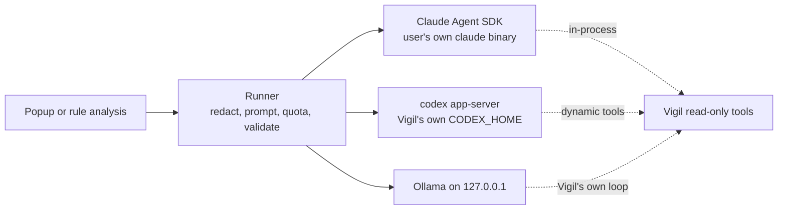

# @vigil/ai

Connects Vigil to the AI the user already has: their own signed-in Claude Code, their own Codex (ChatGPT plan), or a local model through Ollama. The model is never in the blocking path. It explains what Vigil's rules already decided, and it runs out-of-band analysis whose output is a proposal a person approves.



## Using it

```ts
import { createVigilAi, defaultAiSettings } from '@vigil/ai';
import { z } from 'zod';

const ai = createVigilAi({ settings: defaultAiSettings(appSupportDir), log, pins });

const result = await ai.run({
  purpose: 'analyze', // or 'explain'
  urgency: 'background', // or 'now'
  instructions: 'Propose detection rules for ...',
  data: telemetrySummary, // redacted and size-capped before it leaves the Mac
  output: z.object({ rules: z.array(RuleProposal) }),
  deadlineMs: 120_000,
});
if (result.ok) result.value; // validated against the schema
```

## Finding the AI apps you already have

Nothing needs setting up. Vigil looks for each app on every check and uses the first one that is installed and signed in, in the order Claude, Codex, Ollama:

| App         | Found by                                                      | Signed in when                                                 |
| ----------- | ------------------------------------------------------------- | -------------------------------------------------------------- |
| Claude Code | `claude` on PATH, `~/.local/bin`, `~/.claude/local`, Homebrew | `claude auth status` says so (your normal Claude Code login)   |
| Codex       | `codex` in the same places                                    | You clicked Sign in with ChatGPT in Vigil once (see below)     |
| Ollama      | A server on `127.0.0.1:11434`                                 | Always; Vigil picks the largest installed model that has tools |
| Copilot     | `copilot` in the same places                                  | Detected only; Vigil can't use it until its adapter lands      |

`watchAiApps(ai, { onChange })` reports each change (installed, signed in or out, a binary from a new signer) for the settings screen and menu bar. `detectAiApps(ai)` gives a one-off snapshot.

Codex is the one app that needs a click. Codex always loads the config in its home folder, including your MCP servers, and none of its settings turn that off for the app server (checked against 0.157.1: a server in your `config.toml` still starts). So Vigil keeps its own Codex home, and `ai.signIn('codex')` returns ChatGPT's own sign-in page for the app to open. Codex stores the login; Vigil never sees it.

`result.reason` on failure is one of `quota`, `timeout`, `invalid_output`, `no_provider`, `error`. Every prompt is recorded through `log` so the user can see what was sent.

## What the agent can and can't do

| Provider | Built-in tools                                                                                                    | Outside config                                                | Network and files                                   |
| -------- | ----------------------------------------------------------------------------------------------------------------- | ------------------------------------------------------------- | --------------------------------------------------- |
| Claude   | `tools: []`, every other request refused by `canUseTool`                                                          | `settingSources: []`, `strictMcpConfig`, no plugins or skills | Empty temp `cwd`, allowlisted env, no session saved |
| Codex    | `shell_tool`, `unified_exec`, `code_mode_host`, web search, apps, plugins, hooks and more off; approvals declined | Vigil's own `CODEX_HOME`                                      | Read-only sandbox without network, ephemeral thread |
| Ollama   | None. Vigil runs the tool loop                                                                                    | None                                                          | Talks only to `127.0.0.1`                           |

Vigil's tools run inside Vigil's process (the Claude SDK's in-process MCP server, Codex's dynamic tools), so there is no port for another program to reach. The user's login stays with the vendor's CLI; this package never reads a credential file or Keychain item.

Binaries are found by absolute path (including the usual Homebrew and `~/.local/bin` locations that a Finder-launched app misses). The first one seen is recorded. A signed binary may update as long as its Apple Team ID stays the same; an unsigned one must keep the same hash. A change stops runs until the user accepts it.

## Quota

Subscription windows come from the vendors' own signals (Claude's `rate_limit_event`, Codex's `account/rateLimits/updated`). Background work stops once Vigil has used its share of a window (10% by default) or the window is 90% full. Work marked `now` runs until the vendor refuses, and then falls through to the next provider, usually Ollama.

## Tests

`pnpm test` checks the settings, and launches the real Claude and Codex binaries far enough to confirm their tool lists and sandbox without calling a model.

The live escape tests use your subscription (or, for Ollama, a local model). CI runs the Ollama ones on every change to this package (`.github/workflows/ai-escape.yml`). They give the agent evidence and a tool result that tell it to read a secret file, write a file and call a local web server, then check that none of it happened:

```sh
VIGIL_LIVE_PROVIDERS=claude,codex,ollama pnpm --filter @vigil/ai test:live
```

Codex needs Vigil's Codex home signed in first: `CODEX_HOME=<dir> codex login`, then set `VIGIL_CODEX_HOME=<dir>`. Ollama uses `VIGIL_OLLAMA_MODEL` if set, otherwise the model Vigil would pick.

## Claude subscription mode

On by default, and a setting. Anthropic's terms allow a user to sign in to the unmodified Claude Code with their own plan, but also say apps built on the Agent SDK should use API keys. `CLAUDE_SUBSCRIPTION_NOTE` is the text setup shows. Switch `claude.mode` to `apiKey` to use a key from the Keychain instead. `pausedByVigil` lets an app update switch a provider off if terms change.
