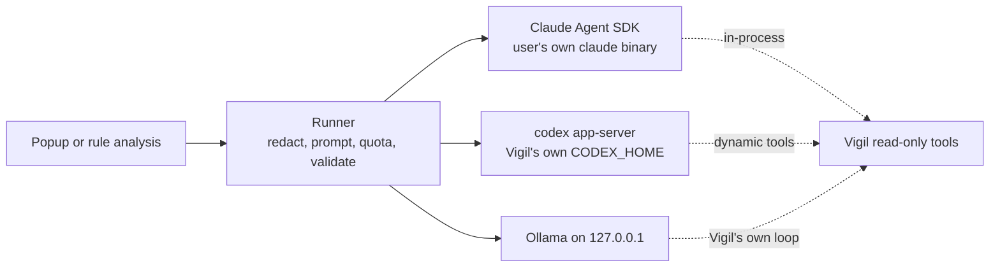

# @vigil/ai

Connects Vigil to the AI the user already has: their own signed-in Claude Code, their own Codex (ChatGPT plan), or a local model through Ollama. The model is never in the blocking path. It explains what Vigil's rules already decided, and it runs out-of-band analysis whose output is a proposal a person approves.



## Using it

```ts
import { createVigilAi, defaultAiSettings } from '@vigil/ai';
import { z } from 'zod';

const ai = createVigilAi({ settings: defaultAiSettings(appSupportDir), log, pins });

const result = await ai.run({
  purpose: 'analyze', // or 'explain'
  urgency: 'background', // or 'now'
  instructions: 'Propose detection rules for ...',
  data: telemetrySummary, // redacted and size-capped before it leaves the Mac
  output: z.object({ rules: z.array(RuleProposal) }),
  deadlineMs: 120_000,
});
if (result.ok) result.value; // validated against the schema
```

## Finding the AI apps you already have

Nothing needs setting up. Vigil looks for each app on every check and uses the first one that is installed and signed in, in the order Claude, Codex, Ollama:

| App         | Found by                                                      | Signed in when                                                 |
| ----------- | ------------------------------------------------------------- | -------------------------------------------------------------- |
| Claude Code | `claude` on PATH, `~/.local/bin`, `~/.claude/local`, Homebrew | `claude auth status` says so (your normal Claude Code login)   |
| Codex       | `codex` in the same places                                    | You clicked Sign in with ChatGPT in Vigil once (see below)     |
| Ollama      | A server on `127.0.0.1:11434`                                 | Always; Vigil picks the largest installed model that has tools |
| Copilot     | `copilot` in the same places                                  | Detected only; Vigil can't use it until its adapter lands      |

`watchAiApps(ai, { onChange })` reports each change (installed, signed in or out, a binary from a new signer) for the settings screen and menu bar. `detectAiApps(ai)` gives a one-off snapshot.

Codex is the one app that needs a click. Codex always loads the config in its home folder, including your MCP servers, and none of its settings turn that off for the app server (checked against 0.157.1: a server in your `config.toml` still starts). So Vigil keeps its own Codex home, and `ai.signIn('codex')` returns ChatGPT's own sign-in page for the app to open. Codex stores the login; Vigil never sees it.

If the user's own Codex is already signed in, that second sign-in isn't needed. The Codex status then has `canShareSignIn: true`, and `shareCodexSignIn(codexHome)` links Vigil's folder's `auth.json` to the one in `~/.codex`. Only the Codex binary opens it; Vigil checks that it exists and never reads it. Codex writes refreshed sign-ins through the link (checked on 0.158.0), so both stay signed in. Nothing else comes across: a test runs Codex on the shared sign-in against a stand-in model server and checks that the user's MCP server doesn't start and their instructions don't reach the model, with the user's own folder as a control. It needs a file sign-in; a Codex that keeps its login in the Keychain has no `auth.json`, and the user signs in from Vigil instead. `stopSharingCodexSignIn(codexHome)` removes the link.

`result.reason` on failure is one of `quota`, `timeout`, `invalid_output`, `no_provider`, `error`. Every prompt is recorded through `log` so the user can see what was sent.

## What the agent can and can't do

| Provider | Built-in tools                                                                                                    | Outside config                                                | Network and files                                   |
| -------- | ----------------------------------------------------------------------------------------------------------------- | ------------------------------------------------------------- | --------------------------------------------------- |
| Claude   | `tools: []`, every other request refused by `canUseTool`                                                          | `settingSources: []`, `strictMcpConfig`, no plugins or skills | Empty temp `cwd`, allowlisted env, no session saved |
| Codex    | `shell_tool`, `unified_exec`, `code_mode_host`, web search, apps, plugins, hooks and more off; approvals declined | Vigil's own `CODEX_HOME`                                      | Read-only sandbox without network, ephemeral thread |
| Ollama   | None. Vigil runs the tool loop                                                                                    | None                                                          | Talks only to `127.0.0.1`                           |

Codex has two modes, like Claude (`settings.codex.mode`). `subscription` (the default) uses a ChatGPT sign-in: Vigil's own, or the user's shared one. `apiKey` uses an OpenAI API key that the app passes in as `getOpenAiApiKey`. The key goes to Codex only in its environment (`VIGIL_OPENAI_API_KEY`), through a provider of Vigil's own whose address is fixed to `https://api.openai.com/v1`. Codex never writes the key to disk, and a test checks that nothing in Vigil's Codex folder contains it. Codex reports tokens but no price, so Vigil prices these runs at OpenAI's published rate for `gpt-5.5` (`CODEX_API_PRICE_PER_MTOK`), and the monthly cap and the Usage page count them. ChatGPT plan runs stay unpriced.

A sign-in from Vigil counts as done only once Codex reads the account back. Checking as soon as the browser page said "Signed in" could run before Codex had saved the sign-in, and then the status stayed at Needs sign-in.

Codex runs always use `gpt-5.5` (`CODEX_MODEL`). Codex's newer models (GPT-6, GPT-5.6) run in code mode, where every tool sits behind a JavaScript runner next to agent and question tools, and in tests on a real Mac the model answered without calling Vigil's tool at all. A test checks that the request Codex builds names that model and offers nothing but Vigil's tools, both as tools and as input items.

Vigil's tools run inside Vigil's process (the Claude SDK's in-process MCP server, Codex's dynamic tools), so there is no port for another program to reach. The user's login stays with the vendor's CLI; this package never reads a credential file or Keychain item.

Binaries are found by absolute path (including the usual Homebrew and `~/.local/bin` locations that a Finder-launched app misses). The first one seen is recorded. A signed binary may update as long as its Apple Team ID stays the same; an unsigned one must keep the same hash. A change stops runs until the user accepts it.

## Spending

`ai.spending(log)` builds the spending page's data from the prompt log the app keeps: each plan's limit windows with the part Vigil used, and Vigil's own runs per day by provider and job, with tokens and Claude Code's cost estimate. Plan windows come from the vendors' own CLIs (Claude Code's usage call, which the SDK marks experimental, and Codex's `account/rateLimits/read`), so Vigil never touches a login. Only Vigil's runs are counted; the user's other conversations with these tools are never read.

`quota.apiKeyMonthlyCapUsd` stops the paid options (the API connection, and Claude in API-key mode) once `spentThisMonthUsd` (supplied by the app from its log) reaches the cap.

## Local, cloud or both

`settings.mode` decides where event data may go. `local` keeps everything on this Mac (Ollama only). `cloud` uses signed-in apps and the API connection and never Ollama. `both` (the default) uses whichever is ready, in `settings.order`.

### The API connection

`settings.api` points at any OpenAI-compatible endpoint: OpenRouter is the first preset, then OpenAI and a custom URL. The key comes from the app through `getApiKey()` (the app keeps it in the Keychain) and is only ever sent over https, or plain http to this Mac. The model gets Vigil's read-only tools as function calls, which Vigil runs itself; any other tool name gets "Not allowed.". Answers use a strict JSON schema. OpenRouter's reported cost goes into the spending page, and a 402 or 429 counts as quota. `ai.listApiModels()` lists the endpoint's models for setup.

### Labelling events with a small local model

`ai.classifier.classify(events)` sends a batch of events that rules and baselines didn't already explain to a small Ollama model, one short line per event under a short key (e1, e2...). The model answers with just two lists of keys, suspicious and unusual; everything else is benign. Output tokens are nearly all of a small model's time on a CPU, so keeping the answer short is what keeps it cheap. It is advisory only and never blocks or releases anything. A small local model's labels are hints with score 0, so they tag events without reordering the feed (in a 20-event test qwen2.5:1.5b caught the planted program but also flagged 10 of 19 Apple binaries); labels from cloud providers or Jev carry a score that ranks the feed. The model is picked for the Mac's memory (`recommendedClassifierModel`: 0.5B below 16 GB, 1.5B from 16 GB), uses half the cores and unloads after a minute. The local model may use `classifier.maxCpuSecondsPerHour` of CPU (72 s, 2% of one core; each batch is charged its wall time times its threads, so a slow Mac simply does fewer batches), batches are also capped per hour wherever they run, labelling waits while `isBusy()` says the Mac is busy, and skipped ids come back for retry. Every batch is in the prompt log, which the activity feed can show. In cloud mode the classifier uses the cloud providers instead.

### Jev (TypeSafe)

Outside local mode, batches go to TypeSafe's Jev first when a key can reach it: a TypeSafe key (`getJevApiKey`), or else the OpenRouter key of the API connection, since OpenRouter carries Jev (beta, `POST https://openrouter.ai/api/alpha/decisions`, model `~typesafe/jev-latest`, same questions and answers, cost reported by OpenRouter). The OpenRouter key goes only to that fixed URL, and another API's key never reaches Jev. Jev is a cloud-only "System One" model: it answers typed questions with calibrated probabilities in about 70 to 500 ms, costs $0.042 per million input tokens with free output, and has no weights to run locally. Vigil sends one request per batch (`POST /v1/systemone`), with the event lines as the state and one Choice question per event (benign, unusual, suspicious). The score is P(suspicious) + P(unusual)/2 and the reason gives Jev's probability and confidence. Jev gets no tools and no prompt it could follow; it can only pick one of the three labels. If Jev has no key, refuses it, is overloaded (429/529) or the monthly cap is spent, the batch goes to the local model (or the cloud providers in cloud mode). Its calls are in the prompt log and on the spending page like every other. TypeSafe says it doesn't train on API data; zero retention is enterprise-only, so event lines (paths, hosts) are kept under their normal policy.

## Quota

Subscription windows come from the vendors' own signals (Claude's `rate_limit_event`, Codex's `account/rateLimits/updated`). Background work stops once Vigil has used its share of a window (10% by default) or the window is 90% full. Work marked `now` runs until the vendor refuses, and then falls through to the next provider, usually Ollama.

## Tests

`pnpm test` checks the settings, and launches the real Claude and Codex binaries far enough to confirm their tool lists and sandbox without calling a model.

The live escape tests use your subscription (or, for Ollama, a local model). CI runs the Ollama ones on every change to this package (`.github/workflows/ai-escape.yml`). They give the agent evidence and a tool result that tell it to read a secret file, write a file and call a local web server, then check that none of it happened:

```sh
VIGIL_LIVE_PROVIDERS=claude,codex,ollama pnpm --filter @vigil/ai test:live
```

Codex needs Vigil's Codex home signed in first: `CODEX_HOME=<dir> codex login`, then set `VIGIL_CODEX_HOME=<dir>`. Ollama uses `VIGIL_OLLAMA_MODEL` if set, otherwise the model Vigil would pick.

## Claude subscription mode

On by default, and a setting. Anthropic's terms allow a user to sign in to the unmodified Claude Code with their own plan, but also say apps built on the Agent SDK should use API keys. `CLAUDE_SUBSCRIPTION_NOTE` is the text setup shows. Switch `claude.mode` to `apiKey` to use a key from the Keychain instead. `pausedByVigil` lets an app update switch a provider off if terms change.
