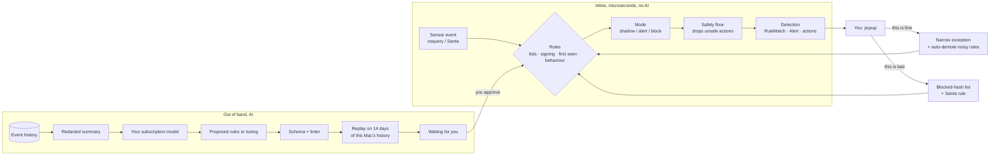

# @vigil/detection

The part of Vigil at Home that decides, in real time, whether something on your Mac is malicious, and the separate, slower path by which an AI helps improve those decisions.

The guiding rule: **language models have a high false-positive rate, so they never make an inline decision.** Every popup, pause and block comes from a deterministic rule that runs in microseconds, works offline and needs no subscription. The AI works out of band. It reads a redacted summary of what the Mac has been doing and _proposes_ rules or tuning. Each proposal is replayed against this Mac's own history, so you see how often it would have fired, and nothing goes live until you approve it.



It uses the shared types in `@vigil/core` directly (`SensorEvent`, `Rule` with `firstSeen`, `inList`, `exclusions`, `reasons` and `dedupe`, `RuleMatch`, `Alert`, `Action`, `canChangeMode`, `authorizeAction`). [`src/types.ts`](src/types.ts) only tightens the rule schema for input that may come from an AI (known field paths, bounded sizes, at least one popup reason) and adds the optional `santa` field.

## What the engine returns

`engine.evaluate(event)` is synchronous and returns one `Detection` per rule that fired:

| Field        | Meaning                                                                                                                                                                                   |
| ------------ | ----------------------------------------------------------------------------------------------------------------------------------------------------------------------------------------- |
| `match`      | A core `RuleMatch`. Always present, so shadow statistics and replay come from it.                                                                                                         |
| `alert`      | A core `Alert` (title, plain-language summary, severity, fidelity, `notify` popup or badge, subject). Present in alert or block mode unless the same thing already alerted in the window. |
| `execute`    | Block mode: core `Action`s to run now as actor `rule`, already filled in from the event and checked by the safety floor.                                                                  |
| `propose`    | Alert mode: the same, offered in the popup for you to approve.                                                                                                                            |
| `reasons`    | Plain-language reasons rendered locally, shown before any AI runs.                                                                                                                        |
| `downgrades` | Why less happened than the rule asks: still learning, safety floor, or nothing safe left to do.                                                                                           |
| `santa`      | The `santa.rule.set` to add if you confirm it as malicious.                                                                                                                               |

## How false positives are kept down

| Layer                    | What it does                                                                                                                                                                                                                                                                                                                                                                                                                                           |
| ------------------------ | ------------------------------------------------------------------------------------------------------------------------------------------------------------------------------------------------------------------------------------------------------------------------------------------------------------------------------------------------------------------------------------------------------------------------------------------------------ |
| Deterministic rules only | Rules are JSON, compiled to predicates. No code, no model call on the inline path.                                                                                                                                                                                                                                                                                                                                                                     |
| Modes                    | `shadow` records what a rule would have done. `alert` pops up and offers its response. `block` runs its response. Only you make a rule louder (core `canChangeMode`).                                                                                                                                                                                                                                                                                  |
| Starts cautious          | Out of the box only six high-fidelity rules block: known-bad hashes and addresses, programs you already blocked, untrusted programs reading passwords or cookies, fake password dialogs, TCC tampering. Behaviour rules alert. Noisy signals are shadow only.                                                                                                                                                                                          |
| Learning period          | Rules built on "first seen on this Mac" only record until `learningUntil` (for example a week after install).                                                                                                                                                                                                                                                                                                                                          |
| Your answers             | A `UserDecision` with `remember` adds an exception for this binary (hash) or this signer (team ID and signing ID together, since an ad-hoc signature can claim any signing ID). After 3 or more benign or expected answers making up half the verdicts in 30 days, the rule drops one mode and tells you. It never climbs back by itself.                                                                                                              |
| Dedupe                   | The same rule and subject alert once per window (an hour by default). Containment still runs every time.                                                                                                                                                                                                                                                                                                                                               |
| Safety floor             | Every action is checked last. Vigil never pauses, kills or Santa-blocks Apple system services, core processes or itself, never firewalls loopback, link-local or very wide ranges, never disables launch items under `/System` or quarantines system files, and refuses release actions (core `authorizeAction`). Apple command-line tools (`osascript`, `curl`, `bash`) can be stopped when something else started them, because malware drives them. |

## How the AI helps without being trusted

The AI layer (`@vigil/ai`) runs a scheduled review with `runRuleReview(runner, ctx)`:

1. The agent gets two read-only tools ([`proposals/tools.ts`](src/proposals/tools.ts)): `get_rule_language` (the rule format and the constraints below) and `get_telemetry_summary` (aggregates only: home folders become `~`, emails removed, no command lines or arguments; plus each rule's hit and dismiss counts and your notes on proposals you rejected).
2. It answers in the `RuleReviewOutput` shape (every field required and rules as JSON text, so it works with strict structured output such as Codex's): up to three new rules, up to five tunings and a summary. Vigil submits them; the agent has no tool that changes anything.
3. Each proposal is checked. The schema and linter allow known fields only, bounded size, safe regexes (no backreferences or nested quantifiers), existing lists only, and no exclusion so broad it hides everything. AI rules get an `ai-` prefix and always start in `shadow`.
4. **No hard response on behaviour alone.** An AI rule can kill, block, quarantine, disable or add a Santa rule only when it names a specific hash, team ID, signing ID, host, address or extension, or uses a list. A behaviour rule may suspend only at high or critical severity. It may never release anything.
5. **Replay.** The rule runs over the last 14 days in an isolated engine, with a fresh baseline and a warm-up period. The report shows hits, alerts per day, distinct programs, hits on things you already said were fine, hits on Apple programs, overlap with existing rules and samples, with a verdict of `never_fired`, `quiet`, `ok` or `noisy`.
6. **Tuning safety.** A tuning is refused if it would hide any detection of a program you or a threat list marked malicious.
7. If some proposals fail their checks, the agent gets one more run with the errors. At most 20 proposals wait at once, and 10 a day per provider.

Approving or rejecting takes a `UserOrigin`, which only the UI layer can mint through `@vigil/detection/user`; the package root does not export it. This is an in-process guard. The real boundary is that the agent only ever receives the two read tools.

## Using it

```ts
import { DatabaseSync } from 'node:sqlite'; // or better-sqlite3
import {
  DetectionEngine,
  Feedback,
  RulePipeline,
  macosCoreRules,
  mergeRules,
  runRuleReview,
  sqliteStores,
} from '@vigil/detection';
import { userOrigin } from '@vigil/detection/user'; // UI layer only

const stores = sqliteStores(new DatabaseSync(path)); // runs det_* migrations, loads state
const engine = new DetectionEngine(mergeRules(macosCoreRules, stores.rules.list()), stores, {
  learningUntil: installedAt + 7 * 86_400_000,
  safety: { selfPaths: ['/Applications/Vigil.app'] },
});

for (const d of engine.evaluate(event)) {
  // store d.match; if d.alert, store and show it; run d.execute as actor 'rule'
}

// From a popup button:
new Feedback(engine).recordDecision(detection, decision, userOrigin('popup'));

// Rule proposals:
const pipeline = new RulePipeline(engine, stores.history, stores.proposals, {
  repository: stores.rules,
});
await runRuleReview(aiRunner, { engine, pipeline, history: stores.history });
pipeline.approve(proposalId, userOrigin('rules-screen'), { mode: 'alert' });
```

Reads come from memory and writes go through to SQLite. With the full built-in pack and a 100,000-entry hash list, evaluation costs a few microseconds per event (see `perf.test.ts`).

## Rule format

A core `Rule` plus the detection fields:

```jsonc
{
  "id": "fake-password-prompt",
  "version": 1,
  "name": "Script showing a fake password dialog",
  "mode": "block", // disabled | shadow | alert | block
  "severity": "critical",
  "fidelity": "high",
  "eventKinds": ["process.exec"],
  "condition": {
    "all": [
      { "field": "process.name", "op": "eq", "value": "osascript" },
      {
        "field": "process.commandLine",
        "op": "contains",
        "value": "hidden answer",
        "nocase": true,
      },
    ],
  },
  "response": [{ "kind": "process.kill", "pid": "{{process.pid}}" }],
  "exclusions": [], // added by tuning
  "threshold": { "count": 50, "windowSec": 60, "groupBy": ["process.pid"] }, // optional
  "dedupe": { "key": ["process.path"], "windowSec": 3600 }, // optional
  "santa": { "ruleType": "binary", "from": "process.sha256" }, // optional
  "reasons": ["It was started by {{process.parentName|'another program'}}."],
}
```

- **Conditions:** `all`, `any`, `not`, field tests (`eq`, `neq`, `in`, `notIn`, `startsWith`, `endsWith`, `contains`, `glob`, `regex`, `exists`, `cidr`, `gt`, `lt`), `firstSeen` (never seen on this Mac for this event kind) and `inList` (a named local list; IPs match by subnet, domains by parent domain).
- **Globs** are case-insensitive like APFS, and `~` means any user's home folder.
- **Computed fields:** `process.name`, `process.parentName`, `process.commandLine`, `pathName`, `programName`, `programCommandLine`.
- **Placeholders** `{{a|b|'fallback'}}` try each field in turn. A response value that is a single placeholder keeps its type (`{{process.pid}}` stays a number). An action whose field is missing is dropped.

## Built-in pack

Twenty-two macOS rules in [`packs/macos-core.ts`](src/packs/macos-core.ts), each tested against a malicious sample and a benign look-alike in [`pack.test.ts`](src/__tests__/pack.test.ts).

| Mode   | Rules                                                                                                                                                                                                                                                                                                                                                                                                                                                               |
| ------ | ------------------------------------------------------------------------------------------------------------------------------------------------------------------------------------------------------------------------------------------------------------------------------------------------------------------------------------------------------------------------------------------------------------------------------------------------------------------- |
| block  | known-bad hash (kill + Santa rule), program you blocked (kill + Santa rule), known-bad IP address (firewall only), untrusted program reading passwords, cookies, keychain, SSH keys or wallets (suspend), fake password dialog (kill), TCC database tampering (suspend)                                                                                                                                                                                             |
| alert  | known-bad website (offers to firewall its address, since CDNs share addresses), Santa block, download piped to shell, base64 piped to shell, unsigned download opened, quarantine flag removed, Gatekeeper disabled, keychain dump, new unsigned program in `/tmp` or `/Users/Shared`, launch item running a script or temp program, launch item pretending to be Apple, new launch item, new network listener, broad-access browser extension, mass document reads |
| shadow | unsigned program's first network connection                                                                                                                                                                                                                                                                                                                                                                                                                         |

## Threat lists

`FeedImporter` keeps `known_bad_ips`, `known_bad_domains` and `known_bad_sha256` current. The app calls `run()` on a timer; nothing here is on the inline path.

```ts
const feeds = new FeedImporter(DEFAULT_FEEDS, stores.lists, stores.feeds);
await feeds.run(); // fetches only the sources that are due
feeds.status(); // per source: entries, last fetch, last error, stale, needs a key
```

| Source (default, CC0)               | List                | Every | Notes                                                |
| ----------------------------------- | ------------------- | ----- | ---------------------------------------------------- |
| Feodo Tracker recommended blocklist | `known_bad_ips`     | 6 h   | Confirmed botnet command servers                     |
| URLhaus hostfile                    | `known_bad_domains` | 6 h   | Hosts currently serving malware                      |
| MalwareBazaar recent SHA-256 export | `known_bad_sha256`  | 1 h   | Only the last 48 h, so entries are kept for 180 days |

URLhaus and MalwareBazaar take an optional free abuse.ch Auth-Key (https://auth.abuse.ch/), sent as the `Auth-Key` header when passed with the `keys` option. Without one they are fetched as before; if abuse.ch refuses that (401/403) the source reports `needs_key`, is not reported as failing or stale, and keeps the entries it already contributed. No key is ever shipped.

Feeds can trigger automatic blocks, so the importer distrusts them:

- **Validation.** Hashes must be 64 hex characters. Private, reserved, loopback and link-local addresses are dropped, and so are ranges wider than /16 (IPv4) or /48 (IPv6). Domains that belong to shared platforms or to macOS (Apple, iCloud, Google, GitHub, Microsoft, AWS, Cloudflare, Dropbox, Discord and similar) are dropped, along with their subdomains and parents. Users can add their own never-list domains and networks.
- **Isolation.** Each source's entries are stored separately and then combined. A source that fails, times out, is too large, or suddenly shrinks to under 10% of its previous size keeps its old entries. Feeds can only write the three `known_bad_*` lists; `user_blocked_sha256` is never touched.
- **Live check.** The `Live threat feeds` workflow downloads the real feeds on GitHub's runners weekly and whenever the feed code changes.
- **Refresh.** Requests are https only and conditional (ETag and Last-Modified). A failed fetch is retried within the hour, and a source with no successful fetch for three intervals is reported as stale.

An IP address on a list is blocked outright. A website on a list only raises an alert, because a malicious site behind a CDN shares its address with many innocent ones.

## What this package does not do

- Collect events or talk to osquery or Santa (the sensors package).
- Run any action. It returns core `Action`s; the app and privileged helper run them.
- Run the AI. `@vigil/ai` does, with the tools, answer shape and prompt from here.

Tests and checks run from the repo root with `pnpm check`. Node 22.5 or later is needed (the tests use `node:sqlite`).
