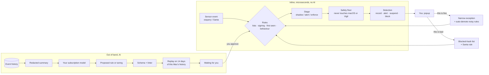

# @vigil/detection

The part of Vigil at Home that decides, in real time, whether something on your Mac is malicious, and the separate, slower path by which an AI helps improve those decisions.

The guiding rule: **language models have a high false-positive rate, so they never make an inline decision.** Every popup, pause and block comes from a deterministic rule that runs in microseconds, works offline and needs no subscription. The AI works out of band. It reads a redacted summary of what the Mac has been doing and *proposes* rules or tuning. Each proposal is replayed against this Mac's own history, so you see how often it would have fired, and nothing goes live until you approve it.



## How false positives are kept down

| Layer | What it does |
| --- | --- |
| Deterministic rules only | Rules are JSON, compiled to predicates. There is no code in a rule and no model call on the inline path. |
| Stages | `shadow` records what a rule would have done. `alert` may pop up but never touches a process. `enforce` may suspend or block. Only you move a rule up. |
| Starts cautious | Out of the box, only near-certain rules enforce: known-bad lists, programs you already blocked, untrusted programs reading passwords or cookies, fake password dialogs, TCC tampering. Behaviour rules warn. Noisy signals are shadow only. |
| Learning period | Rules built on "first seen on this Mac" only record until the baseline has settled (you set `learningUntil`, e.g. a week after install). |
| Your answers | "This is fine" adds an exception scoped to that exact program (hash, then signer, then path). After 3 or more such answers making up half the verdicts in 30 days, the rule drops a stage and tells you. It never climbs back by itself. |
| Dedupe | The same rule and program pops up once per window (an hour by default). Enforcement still happens every time. |
| Safety floor | Whatever a rule asks, Vigil never pauses or kills Apple system services, core processes or itself, never firewalls loopback or link-local addresses, and never disables launch items under `/System`. Apple command-line tools (`osascript`, `curl`, `bash`) can be stopped when something else started them, since malware drives them. |

## How the AI helps without being trusted

The AI is handed four tools and nothing else ([`proposals/tools.ts`](src/proposals/tools.ts)):

- `get_rule_language`: the rule format and the constraints below.
- `get_telemetry_summary`: aggregates only. Home folders are replaced by `~`, emails are removed, and no command lines or arguments are included. It also shows each rule's hit and dismiss counts, and your notes on proposals you rejected, so it learns from them.
- `propose_rule`: queues a new rule. Its id gets an `ai-` prefix and any stage it sets is ignored.
- `propose_tuning`: queues an exclusion for an existing rule.

Every proposal goes through checks that return fixable errors:

- **Schema and linter.** Only known fields, bounded size and depth, regexes with no backreferences or nested quantifiers, only lists that exist, and no exclusion so broad it hides everything.
- **No blocking on behaviour alone.** An AI rule can only `block` when it names a specific hash, signer, domain, address, extension or launch item, or uses a list. A behaviour rule can ask to `suspend` only at high or critical severity.
- **Replay.** The rule runs over the last 14 days in an isolated engine with a fresh baseline and a warm-up period. The report shows hits, popups per day, distinct programs, hits on things you already said were fine, hits on Apple programs, overlap with existing rules, and samples. The verdict is `never_fired`, `quiet`, `ok` or `noisy`.
- **Tuning safety.** A tuning is refused if it would hide any detection of a program you or a threat list marked malicious.
- **Budget.** At most 20 proposals wait at once, and each provider gets 10 a day.

Approval and rejection need a `UserOrigin`, which only the UI layer can mint through `@vigil/detection/user`. The package root does not export it, so the tool handlers cannot approve anything. This guard works within one process. The real boundary is that the agent only ever receives the four tools above.

`RULE_REVIEW_PROMPT` ([`proposals/prompt.ts`](src/proposals/prompt.ts)) is the instruction for a scheduled review run.

## Using it

```ts
import { DatabaseSync } from "node:sqlite"; // or better-sqlite3
import { DetectionEngine, Feedback, RulePipeline, macosCoreRules, mergeRules, sqliteStores } from "@vigil/detection";
import { userOrigin } from "@vigil/detection/user"; // UI layer only

const stores = sqliteStores(db); // runs det_* migrations, loads state
const engine = new DetectionEngine(mergeRules(macosCoreRules, stores.rules.list()), stores, {
  learningUntil: installedAt + 7 * 86_400_000,
  safety: { selfPaths: ["/Applications/Vigil.app"] },
});

for (const d of engine.evaluate(event)) {
  // d.action: record | alert | suspend | block, d.target: process | network | persistence
  // d.reasons: plain-language text for the popup, shown before any AI runs
}

// From a popup button:
new Feedback(engine).recordVerdict(detection, "benign", userOrigin("popup"), { event });

// Rule proposals:
const pipeline = new RulePipeline(engine, stores.history, stores.proposals, { repository: stores.rules });
pipeline.approve(proposalId, userOrigin("rules-screen"), { stage: "alert" });
```

`evaluate` is synchronous: reads come from memory and writes go through to SQLite. With the full built-in pack and a 100,000-entry hash list it costs about 3 µs per event (`npm run bench`).

## Rule format

```jsonc
{
  "id": "fake-password-prompt",
  "title": "Script showing a fake password dialog",
  "kinds": ["process_exec"],
  "severity": "critical",           // info | low | medium | high | critical
  "action": "suspend",              // record | alert | suspend | block
  "stage": "enforce",               // shadow | alert | enforce
  "target": "process",              // process | network | persistence
  "condition": { "all": [
    { "field": "process.name", "op": "eq", "value": "osascript" },
    { "field": "process.commandLine", "op": "contains", "value": "hidden answer", "ignoreCase": true }
  ]},
  "exclusions": [],                 // added by tuning
  "threshold": { "count": 50, "withinSec": 60, "groupBy": ["process.pid"] },  // optional
  "dedupe": { "key": ["process.path"], "windowSec": 3600 },                  // optional
  "santa": { "ruleType": "BINARY", "from": "process.sha256" },               // optional
  "reasons": ["A script opened a password box that did not come from macOS."]
}
```

Conditions are `all`, `any`, `not`, field matches (`eq`, `neq`, `in`, `notIn`, `startsWith`, `endsWith`, `contains`, `glob`, `regex`, `exists`, `cidr`, `gt`, `lt`), `firstSeen` (never seen on this Mac for this event kind) and `inList` (a named local list; IPs match by subnet and domains by parent domain). Globs are case-insensitive like APFS, and `~` means any user's home folder. Computed fields: `process.name`, `process.parentName`, `process.commandLine`, `file.name`, `persistence.programName` and `persistence.commandLine`.

## Built-in pack

Twenty-one macOS rules in [`packs/macos-core.ts`](src/packs/macos-core.ts), each tested against a malicious sample and a benign look-alike in [`test/pack.test.ts`](test/pack.test.ts).

| Stage | Rules |
| --- | --- |
| enforce | known-bad hash, program you blocked, known-bad destination (firewall only), untrusted program reading browser passwords, cookies, keychain, SSH keys or wallets, fake password dialog, TCC database tampering, Santa block popup |
| alert | download piped to shell, base64 piped to shell, unsigned download opened, quarantine flag removed, Gatekeeper disabled, keychain dump, new unsigned program in `/tmp` or `/Users/Shared`, launch item running a script or temp program, launch item pretending to be Apple, new launch item, new network listener, broad-access browser extension, mass document reads |
| shadow | unsigned program's first network connection |

## What this package does not do

- Collect events or talk to osquery or Santa (Sensors and blocking thread).
- Pause, kill or firewall anything. It returns a `Detection` and the app and privileged helper act on it.
- Run the AI (Secure LLM subscription integration thread). It supplies the tools, handlers and prompt.
- Fetch threat feeds. Lists are loaded with `stores.lists.replace(name, entries, meta)`. Rules expect `known_bad_sha256`, `known_bad_domains`, `known_bad_ips` and `user_blocked_sha256`.

## Scripts

```sh
npm test          # vitest
npm run typecheck
npm run build
npm run bench     # inline cost
```

Requires Node 22.5 or later (the tests use `node:sqlite`).
